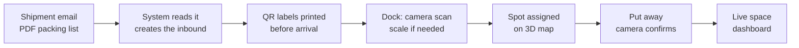

# Warehouse Space & Tracking System — Project Overview

2026-09-18 · @Someone

We're building a system for a third-party logistics (3PL) client that tells warehouse workers where to put each pallet and shows, in real time, how much space is left for new containers. It replaces a warehouse management system that isn't working and is being designed to make the warehouse ready for a customs bonded area.

## The client and the problem

The client stores goods on behalf of their own customers across 4 warehouses. We start with one site, then roll out to the other 3.

| Pilot site |  |
| --- | --- |
| Size | 35,000 sq ft, about 2,000 sq ft of it docks |
| Volume | 60+ containers per week |
| Dock doors | 3 |
| Storage | Mix of racking and open floor stacking, free to rearrange |
| Goods | Mostly palletized, long-life goods; occasional bulk (wheat) and extra-long items |
| Outbound | Mostly whole pallets; some customers pick and pay per carton |

Today they run a warehouse system called Express, patched with Google Sheets. Nobody can see what's where without walking the floor, and staff can't keep the data up to date when busy. Pallets go wherever there's room when they come off the truck, so space is wasted and they can't say how much room is left for new business.

The client's three goals, in their words:

1. Optimize space.
2. Full visibility into available space, because money is being lost.
3. Be ready for customs, so the warehouse is a no-brainer for bonded storage.

## How it works

Every pallet gets a planned spot before it leaves the dock, and the system always knows how much space is left.

1. **Email in.** The customer's shipment email and PDF packing list are read automatically: pallet count, sizes, weights, stackability and expected length of stay.
2. **Labels ready.** A large QR label is printed for each pallet at the office next to the dock, before the truck arrives.
3. **Receiving.** A dock camera reads the label. Pallets are weighed on a dock scale when weight matters for stacking.
4. **Spot assigned.** The system picks a location on a 3D map of the warehouse, including vertical space.
5. **Put away.** The forklift driver sees the spot on a phone or forklift-mounted tablet. Cameras confirm the pallet landed there; a phone scan is the backup.
6. **Visibility.** Office staff, managers and sales see occupancy, stock per customer and space available for new containers.
7. **Outbound.** Release request emails are read the same way, and the freed space shows up immediately.

The system is bilingual (English and French), works in imperial units, and has separate roles for managers, office staff and drivers. Only a manager can override a placement, and every override needs a reason.

## How the system decides where a pallet goes

The core of the product is a placement engine that fills the building in three dimensions without burying pallets that need to leave soon.

| Factor | Rule |
| --- | --- |
| Length of stay | Short stays near the docks and on top; long stays deeper and lower in the stack |
| Stackability | Declared by the customer per product: no stacking, 2 high max, or higher |
| Weight | Heavy pallets at the bottom and on lower rack levels |
| Size | Matched to the free space left in a lane, stack or rack position |
| Height limit | Nothing above the fire-code clearance under the sprinklers |
| Grouping | Pallets from the same shipment kept together where possible |
| Customs | Bonded goods only inside the bonded cage |

Because the floor-stacked area is open space, the system can also recommend a better layout, including where new racking would add capacity.

## Cameras and tracking

No cameras are installed yet, so the camera setup is designed from scratch. The client has an electrician and IT contractor, and can provide Wi-Fi and high-speed internet across the site.

The client ranked what they want from cameras:

1. Confirm each pallet landed in the right spot.
2. Follow every pallet automatically.
3. Show which spots are full or empty.
4. Measure pallets at the dock.

The approach: large QR labels on at least two sides of each pallet, a camera at the dock, and either forklift-mounted cameras or a driver phone scan to confirm the final spot. Ceiling cameras handle full-or-empty detection. Fully automatic tracking across the floor is the hardest part, since forks and stacked pallets block labels, so it comes in phases with the phone scan as a permanent fallback.

## Customs bond readiness

The client plans to add a caged customs bonded area, and wants the warehouse to stand out to CBSA. The licence type, a sufferance warehouse or a customs bonded warehouse, is still to be decided.

So customs is built in from day one rather than added later:

- Every pallet carries a customs status (in bond or released).
- The bonded cage is its own zone on the 3D map, and bonded goods can't be assigned outside it.
- Every move is logged: who moved which pallet, when, and from where to where, backed by camera footage.
- Customs records can be pulled by pallet, shipment or customer for an audit.

## Status and next steps

Requirements are mostly gathered, and a questionnaire with the remaining open questions has gone to the client. A sketch of the pilot warehouse is in progress.

1. **Demo.** One end-to-end story on the real warehouse layout: an email arrives, labels print, a pallet is scanned, the system assigns a spot, and the space counter updates. Emails and cameras are simulated, and assumptions sit in a settings panel the client can adjust live.
2. **Pilot.** Full system at one warehouse, starting fresh rather than importing data from Express.
3. **Rollout.** The other 3 warehouses, then add-ons: billing calculations and a customer portal where the client's customers see their own inventory.

Open questions still being answered by the client:

- Exact usable height under the sprinklers, racking specs and forklift capabilities
- How accurate customers' stated storage times are
- Which customs licence to pursue, and when
- How they bill customers today
- How available space should be shown: open pallet spots, cubic feet, or "room for X more 40' containers"
